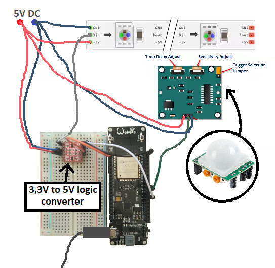

# Ovládanie LED pásika pomocou ESP32, MQTT a HomeAssistant 

Projekt do predmetu PDS na FIT VUT.
Bol testovaný vývojovej doske Wemos. Využíva detektor pohybu HC-SR501 a LED pásik WS2512. Použité knižnice:

  - Neopixelbus (pre správne fungovanie ESP32 trba mať [túto](https://github.com/svenihoney/NeoPixelBus/tree/b0485e09b374b368d5445d319b12501886da9788) verziu)
  - Upravenú knižnicu WS2812FX, ktorá je pribalená ([zdroj](https://github.com/Aircoookie/WLED))
  - Wi-fi knižnica pre ESP32
  - PubSubClient
  - ArduinoJson

Dôvod použitia upravenej knižnice WS2812FX je nekompatibilita Adafruit Neopixel knižnice s ESP32 (https://github.com/adafruit/Adafruit_NeoPixel/issues/139), ktorá sa prejavuje iba pri zapnutej wi-fi.

Schéma zapojenia:



## Podrobnejší popis
V priečinku hassio config sú konfiguračné súbory pre Home Assistant. Senzor pohybu je nakonfigurovaný ako [MQTT binary sensor](https://www.home-assistant.io/components/binary_sensor.mqtt/) a LED pásik ako [MQTT JSON light](https://www.home-assistant.io/components/light.mqtt_json/). Implementácia podporuje nasledujúce funkcie MQTT JSON light:

| Funkcia | Podpora |
| ------ | ------ |
| Brightness | ano |
| Color temperature | - |
| Effects | ano |
| Flashing | ano |
| RGB Color | ano |
| Transitions | - |
| XY Color | - |
| White value | - |

Vytvorená automatizácia odošle "flash" správu LED pásiku, keď pohybový senzor zaznamená pohyb. Neovplyvní to prebiehajúci efekt a vyvolá sa aj keď je LED pásik v hass.io vypnutý.

### O MQTT protokole
MQTT (Message Queuing Telemetry Transport) je TCP protokol, ktorý našiel uplatnenie v IoT systémoch. Bol navrhnutý v IBM a má vlastný ISO štandard. Nahradil kedysi používaný HTTP protokol. Jeho výhodou je jeho jednoduchosť, 3 úrovne QoS, implementácia podľa návrhového vzoru Publisher-Subscriber. Tá sa skladá zo serveru na ktorom je umiestnený broker - centrálny bod a klientov, ktorý predstavujú jednotlivé zariadenia. Server spravuje štruktúru tém - topicov. Klienti môžu do daných tém odosielať správy (publish) alebo dané témy odoberať (subsribe). Vždý pri zmene správy v topicu je rozoslaná PUBLISH správa klientom, ktorý odoberajú daný topic.
Najčastejšie používaný port protokolu je 1883, pri TLS spojení 8883. Schéma komunikácie:

#### Popis komunikácie

Komunikáciu zabezpečuje knižnica PubSubClient. Acknowledgement (ACK) správy nemusíme pri implementácii riešiť. Názvy tém (topicov) boli zvolené s ohľadom na [MQTT best practices](https://www.hivemq.com/blog/mqtt-essentials-part-5-mqtt-topics-best-practices). [Špecifikácia MQTT](http://docs.oasis-open.org/mqtt/mqtt/v3.1.1/os/mqtt-v3.1.1-os.html).


  - Naviazanie spojenia odoslaním CONNECT správy od klienta serveru (brokeru). Táto správa obsahuje clientID pevne nastavené na "ESP32Client". Obsahuje aj meno a heslo, kedže náš MQTT broker ho vyžaduje. Broker na túto správu odpovedá správou CONNACK, ktorou dá klientovi vedieť, že naviazanie spojenia prebehlo úspešne.
  - Po nadviazaní spojenia sa klient prihlási na odber témy "pdsproject/office/ledstrip/set", pomocou ktorej sa rozposielajú správy na zmenu nastavení LED pásika. Prihlásenie prebieha odoslaním správy SUBSCRIBE. Po odpovedi SUBACK je klient úspešne prihlásený na odber danej témy.
  - Najčastejšie používané správy sú správy typu PUBLISH. Tieto správy používa klient (publisher) na odosielanie informácií o aktuálnom stave pohybového senzora (téma: "pdsproject/office/pir") a tiež o aktuálnom stave LED pásika (téma: "pdsproject/office/ledstrip"). PUBLISH správa je preposielaná aj zo serveru klientom a to iba tým, ktorí sú prihlásení na odber odpovedajúcej témy (subscriberi). Potvrdzovanie prijatia správ je realizované v závislosti na QoS. V projekte je využívané QoS 0. Pri tejto úrovni QoS pošle publisher správu PUBLISH brokeru a ďalej sa o nič nestará. Broker ju rovnakým spôsobom pošle subscriberom daného tématu. Ďalšie typy QoS sú zobrazené na obrázku pod textom.
  - Ďalšie správy ktoré MQTT využíva sú PINGREQ a PINRESP, ktoré slúžia na kontrolu či sú klienti aktívny. Správa DISCONNECT slúži na odpojenie od servera.

Typy a QoS a správy na potvrdzovanie PUBLISH správ:


Štruktúra MQTT packetu:


#### Formát správ

Formát správ bol prispôsobovaný platforme Home Assistant. Správy o pohybe z pohybového senzora sú textové správy "ON" (detekovaný pohyb) alebo "OFF" (nedetekovaný pohyb). Čas koľko bude stav senzora nastavený na "ON" je nastaviteľný priamo na pohybovom senzore pomocou potenciometra "Time Delay Adjust" (viz. schéma zapojenia). Formát správ, ktoré využíva LED pásik je JSON a tiež je prispôsobený špecifikácii MQTT JSON Light. Ukážka správy:

```
{
  "brightness": 255,
  "color": {
    "r": 255,
    "g": 255,
    "b": 255,
    "x": 0.123,
    "y": 0.123
  },
  "effect": "blink",
  "state": "ON"
}
```
#### Homeassistant a MQTT

Home assistant sa chová ako ďalší MQTT klient. Prihlasuje sa na odber tém a môže byť aj publisher. Témy v konfigurácii označené ako "state_topic" sú odoberané a témy označené ako "command_topic" sa využívajú na PUBLISH správy.
